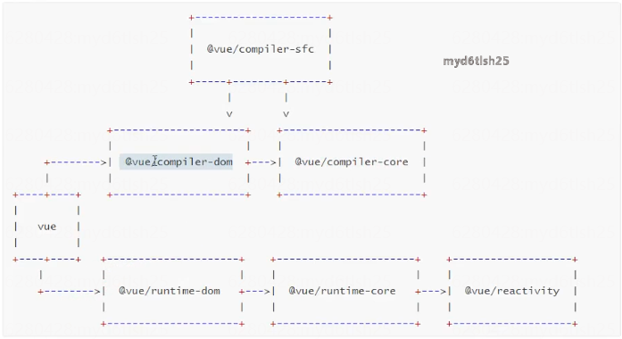

<!--
 * @Author: 李思豪
 * @Date: 2022-06-23 10:01:32
 * @LastEditTime: 2022-06-24 10:00:53
 * @Description: file content
 * @LastEditors: 李思豪
-->

# 区别介绍

> 架构方面

- 源码采用 `monorepo` 方式进行管理,将模块拆分到 package 目录中
- Vue3 采用 ts 开发, 增强类型检查。Vue2 采用 flow
- Vue3 的性能优化, 支持 tree-shaking, 不使用就不会被打包
- vue2 后期引入了 RFC(每个版本要增加什么功能), 使每个版本改动可控 rfcs。

> 内部代码优化

- vue3 劫持数据采用 proxy, vue2 劫持数据采用 defineProperty。defineProperty 有性能问题和缺陷
- vue3 中对模板编译进行了优化,编译时生成了 Block tree, 可以对子节点的动态节点进行收集,可以减少比较,并且采用了 pathFlag 标记动态节点
- Vue3 采用 compositionApi 进行组织功能，解决反复横跳，优化复用逻辑（mixin 带来的数据来源不清晰、命名冲突等),相比 optionsApi 类型推断更加方便
- 增加了 Flagment, Teleport, Suspense 组件。

# —.Vue3 架构分析

## 1.Monorepo 介绍

Monorepo 是管理项目代码的一个方式，指在一个项目仓库( repo)中管理多个模块/包(package)。

- 一个仓库可维护多个模块，不用到处找仓库
- 方便版本管理和依赖管理，模块之间的引用，调用都非常方便
  > 缺点:仓库体积会变大。

## 2.vue3 项目结构

- reactivity:响应式系统
- runtime-core :与平台无关的运行时核心(可以创建针对特定平台的运行时·自定义渲染器)
- runtime-dom:针对浏览器的运行时。包括 DoMAPI，属性,事件处理等
- runtime-test:用于测试
- server-renderer:用于服务器端渲染
- compiler-core:与平台无关的编译器核心, 跨平台
- compiler-dom:针对浏览器的编译模块, 把模板编译成 render 函数
- compiler-ssr:针对服务端渲染的编译模块
- compiler-sfe:针对单文件解析
- size-check :用来测试代码体积
- template-explorer:用于调试编译器输出的开发工具
- shared:多个包之间共享的内容
- vue:完整版本,包括运行时和编译器

  

## 3.安装依赖

| 依赖                        |                        |
| :-------------------------- | ---------------------- |
| typeScript                  | 支持 typeScript        |
| rollup                      | 打包工具               |
| rollup-plugin-typescript2   | rollup 和 ts 的桥梁    |
| @rollup/plugin-nodeLresolve | 解析 node 第三方模块   |
| @rollup/plugin-json         | 支持引入 json          |
| execa                       | 开启子进程方便执行命令 |

```
npm install typescript rol1up rollup-plugin-typescript2 @ro11up/plugin-node-resolvero7lup/plugin-json execa -D
```
